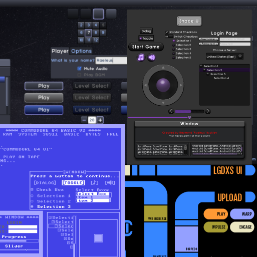

# README #

###  ###

* Use Skin Composer to create skins for LibGDX's Scene2D.UI!
* Version 34
* Live preview of all widgets with configurable options
* Specify tinted, tiled, and custom created Drawables right in the editor
* Includes BitmapFont editor and Image font generator like Shoebox
* Freetype support and custom serializer to generate fonts from Json
* Nine-Patch editor with batch functions for multiple images
* Integrated support for [TenPatch](https://github.com/raeleus/TenPatch) allowing for smart-resizing, animated UI's.
* Implement your own classes allowing for extended Skin functionality
* VisUI template and sample projects included

See more examples and sample code at [Ray3k](https://ray3k.wordpress.com/artwork/ "Free Scene2D UI Skins")

### Contact ###

* This project is maintained by Raymond "Raeleus" Buckley
* http://ray3k.wordpress.com
* raymond.ray3k (at) gmail.com

### Notes ###

Skin Composer now has a wiki: [start here](https://github.com/raeleus/skin-composer/wiki) to begin learning!

To run Skin Composer on OSX, please see the [wiki](https://github.com/raeleus/skin-composer/wiki/Getting-Started-With-Mac "Getting Started With Mac") for details.

Video tutorials are available on [YouTube](https://www.youtube.com/playlist?list=PLl-_-0fPSXFfHiRAFpmLCuQup10MUJwcA)

### License ###
MIT License

Copyright (c) 2019 Raymond Buckley

Permission is hereby granted, free of charge, to any person obtaining a copy
of this software and associated documentation files (the "Software"), to deal
in the Software without restriction, including without limitation the rights
to use, copy, modify, merge, publish, distribute, sublicense, and/or sell
copies of the Software, and to permit persons to whom the Software is
furnished to do so, subject to the following conditions:

The above copyright notice and this permission notice shall be included in all
copies or substantial portions of the Software.

THE SOFTWARE IS PROVIDED "AS IS", WITHOUT WARRANTY OF ANY KIND, EXPRESS OR
IMPLIED, INCLUDING BUT NOT LIMITED TO THE WARRANTIES OF MERCHANTABILITY,
FITNESS FOR A PARTICULAR PURPOSE AND NONINFRINGEMENT. IN NO EVENT SHALL THE
AUTHORS OR COPYRIGHT HOLDERS BE LIABLE FOR ANY CLAIM, DAMAGES OR OTHER
LIABILITY, WHETHER IN AN ACTION OF CONTRACT, TORT OR OTHERWISE, ARISING FROM,
OUT OF OR IN CONNECTION WITH THE SOFTWARE OR THE USE OR OTHER DEALINGS IN THE
SOFTWARE.
